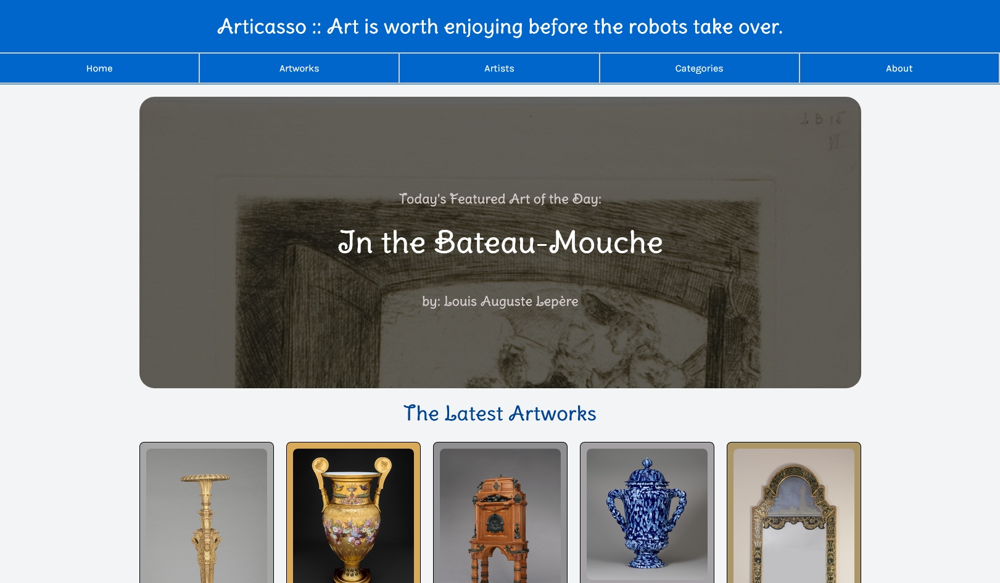

#  Advanced Pre-Work Assignment



My name is Amir Daniali and this is my Advanced Pre-Work Assignment submission for Summer 2025 Code the Dream course.

You can find a link to the Assignment [here](https://codethedream.org/open-adv-pre-work/)

## How to Run 

First download this repository with
```git
git clone https://github.com/amirdaniali/Code-The-Dream.git
```

### Serving Using NPM

Then you need to be able to serve the files locally. One way is by using `node.js` and `http-server`:

#### On Linux, Mac
```Bash
 npm install -g http-server
 cd path/to/the/project
 http-server
 ```

#### if http-server not Installed with -g  

```bash
   npm install -g http-server
   cd path/to/the/project
   ./node_modules/.bin/http-server
```

 You can then access the application on http://localhost:8080 or http://127.0.0.1:8080

### Python

 Alternatively you can use Python’s Built-in HTTP Server

```Bash
cd path/to/your/project
python -m http.server
```
Access the application at http://localhost:8000 in your browser.

Should you run into any issues serving the files you can view the project screenshot in the media folder of this repository. Alternatively you can view the final project hosted via github pages on my personal website [here](https://artic-arts.amirdaniali.com).

## Design Decisions

During the completion of this assignment here are all the issues I came across and all the and design decisions I made. 

### API Options
The options for the APIs in the course are as follows:
- Weather
- Music
- Star Wars
- Marvel Comics
- Art
- Dog/Cat
- Coffee

I had to choose between different api providers and build an app around them. I am a fan of Arts and wouldnt say no to an excuse to build something useful that pleases the spirit as well. So I took a look at the ARTIC Api from Art Institute of Chicago.

Here is the [Website](https://www.artic.edu/) of Art Institute of Chicago.


And Here is the link to the [API Documentation](https://api.artic.edu/docs/#introduction). 


The Project I wanted to make needed to demonstrate the data from at least two endpoints from the api, and allow the user to navigate through them. Since the data already exists I made the design choice to Keep all code in the front-end and didnt feel the need to complicate the logic via a backend. The hope for this project is one day this project can exist in a website somewhere forever without incurring needless server costs. 

### The Architecture

I decide on this following architecture.

1. `index.html`:
   - Purpose: The main HTML file for the application. Contains the structure and links to JavaScript and  CSS files.
   - Description: Serves as the entry point and root for the application UI.

2. `styles.css`:
   - Purpose: CSS imports and custom styling.
   - Description: Sets up styling rules, adding any additional customizations needed.

3. `app.js`:
   - Purpose: Main JavaScript file handling API calls, state management, and DOM updates.
   - Description:
     - Fetches data from the Artic API.
     - Stores state in local variables.
     - Dynamically updates the UI based on user interactions.

4. `helpers.js`:
   - Purpose: Contains helper functions.
   - Description:
     - Functions for API calls (e.g., fetching data).
     - Utility functions like error handling or formatting.

5. `components.js`:
   - Purpose: Encapsulates reusable JavaScript components.
   - Description:
     - Contains functions to create dynamic HTML elements (like artwork cards, search bars).
     - Helps maintain modularity in code.
6. `routes.js`
   - Purpose: Allows the user to view parts of the application by simple clicks. 
   - Description:
     - Contains functions to analyse click events and route them to the proper destinations.
     - Calls the proper functions in `app.js` to populate pages with the correct data.


This is a diagram I made for the way different parts of the project interact:


### Seting up the Controller and View

After reading the api I started coding. I was a little rusty in my JavaScript so it took me a little longer than usual to read the documentations. I managed to code the helper functions that interact with the api in the helpers.js file. The helper functions use the JavaScript Fetch syntax and are all async. 

The only major issue I ran into initially was that the Artic Api doesnt actually return any images (except the thumbnail. They return the image id and the image has to be linked to using a html `` tag. For awhile I kept trying to use javascript to fetch the images from the server programmitaclly, but I kept running into CORS errors. After a long search online about workarounds, I decided to make normal html do the work.

Here is the function I wrote using javascript to fetch the resource from the api:

```javascript
export async function find_art(id = 129884, all_fields = true) {
    console.log('find art initialized with parameter',id);
    const address_parameters = all_fields ? '' : '?fields=id,title,artist_titles,artist_ids,date_display,description,exhibition_history,thumbnail,color,category_titles,category_ids,image_id'
    const addressURL = `https://api.artic.edu/api/v1/artworks/${id}${address_parameters}`
    const returnResponse = await fetch(addressURL, 
        { headers: {
            'AIC-User-Agent': 'Code the Dream Prework @amirdaniali@gh'
        }});
    
    const data = await returnResponse.json();
    console.log('art with id', id,'was found', data);

    return data
}
```

In the lines above the function determines if a reduced set of fields are requested or not. Then it fetches the resource and returns the data. I got distracted while coding the fuction to set a custom `AIC-User-Agent` header as requested by [the documentation](https://api.artic.edu/docs/#image-sizes). I got so distracted I didnt include a try/catch statement in the function until much later. 

Afterwards I began coding the `app.js` file where I setup the interactivity of the main page and made sure the search box was connected to the helper functions to retrieve the user information. After that I started coding the `components.js` file to produce the results of the user searches. 


### Setting Up The Single Page Application

The application I wanted to build had to have many pages. One for Showing the main page, one for showing the page related to the art-pieces themselves and maybe one especially for each artist. Such functionality would require multiple `page.html` files and a complex way of routing them without needing complex express/node backends. At the end I decided to go with a SPA concept I learned from this [blog](https://dev.to/thedevdrawer/single-page-application-routing-using-hash-or-url-9jh)

All routing logic is implemented in `routes.js` file and allows for multiple pages to be loaded with browser URL functionality supported. 

Whenever a new link to a page is clicked, the `routes.js` file checks to see if the element has the class-name: `explicit-outband`. If so it ignores the default behavior of the browser and loads the contexts of the local page into the `main-container` section tag in the main `index.html` file. If it cannot find the classname it treats it as a normal `<a>` tag and allows the link to redirect to another url. 

```javascript
const route = (event) => {
    event = event || window.event; // get window.event if event argument not provided
    event.preventDefault();
    window.history.pushState({}, "", event.target.href);
    locationHandler();
};

// create document click that watches the nav links only
document.addEventListener("click", (e) => {
    if (e.explicitOriginalTarget.className.includes("explicit-outbound") ){
        e.preventDefault();
        route();
    }
    // console.log('target not a link');
    
});

locationHandler();
window.onpopstate = locationHandler;
window.route = route;

export async function locationHandler() {

    // get the url path, replace hash with empty string
    const location = window.location.pathname; // get the url path
    
    // if the path length is 0, set it to primary page route
    let currentView = ['/','']
    if (location.length == 0) {
        location = "/";
    }
    else{ 
        currentView = location.split('/');
        currentView.splice(0, 1);
        // console.log('location=', location, 'currentView=',currentView);
       
    }
    
    // get the route object from the routes object
    const route = routes[currentView[0]] || routes["404"];
    // get the html from the template
    const html = await fetch(route.template).then((response) => response.text());
    // set the content of the content div to the html
    
   // prepare the wrapper section and remove the current view
    document.getElementById("page-container").innerHTML = '';
    document.getElementById("main-container").innerHTML = '';
    if (currentView[0] == 'art') {
        document.getElementById("page-container").innerHTML = html; // Only for the art page for special styling

    }
    else {
        document.getElementById("main-container").innerHTML = html; // All other routes use the main container.

        
    }
    // document.getElementById("main-container").innerHTML = html;
    // set the title of the document to the title of the route
    document.title = route.title;
    // set the description of the document to the description of the route
    document
        .querySelector('meta[name="description"]')
        .setAttribute("content", route.description);
    // console.log('routing ended up at', location);
    
      // Furthur down:
    
    switch (currentView[0]) {
        case '':
            console.log('Home Loaded.')
            populatePage();
            displayArtworkofDay();
            displayCuratedlist();
            break;
         case 'art':
            // displayArt();
            break;
         case 'artist':
            // displayArtist();
            break;
         case 'about':
            // displayAbout();
            break;
        case 'category':
            // displayCategory();
            break;
         
}}

```

After loading the custom resources for any page `routes.js` calls multiple functions in `app.js` to load the interactivity of the proper page the user has requested. `app.js` then can call `helpers.js` to request the resources from the ARTIC API and then call `components.js` to display the resources to the user. 

## Conclusion

By using the architecture mentioned above I can make multiple pages just behave like static files and besides needing a service to load the files, no resource is wasted with unneeded computations. All logic is client-side and the project can be used with minimal costs as long as the ARTIC Api remains online. 

This project helped me greatly to think outside the box to recreate the typical luxuries we use everyday granted to us by frameworks like React or Vue inside pure javascript. 

I thank Code the Dream team to inspire me to create this project celebrating the beautiful art collection of the Art Institute of Chicago.


Reminder: You can view the website and the project on my personal website [here](https://artic-arts.amirdaniali.com).

## Todo: 

If I return to this project in the future here is the list of things I'd love to add to the functionality of the website.

- Find a way to show artist work. Unfortunately I couldnt find anyway so far to show which arts were made by which artists to populate their pages. I have already made the component that those possible results will be placed at. I hope I can find a way to show the arts made by each artist in their own page somehow. 
- Add back forward functionality to the pages so by changing pages back to where you have been you see the arts you saw before. 
- Write about how I added the art of the day functionality 
- Write about how components are structured